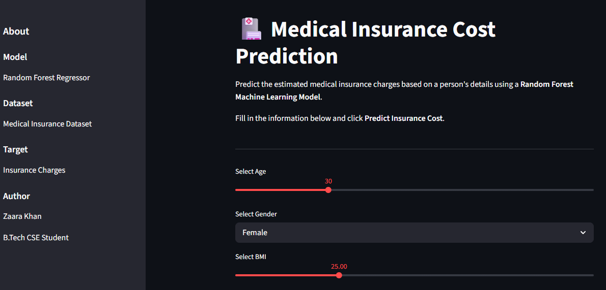
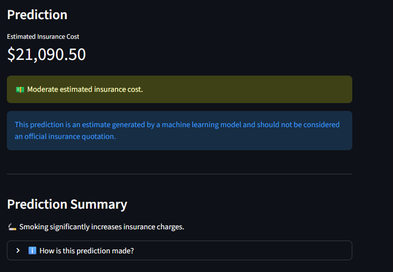
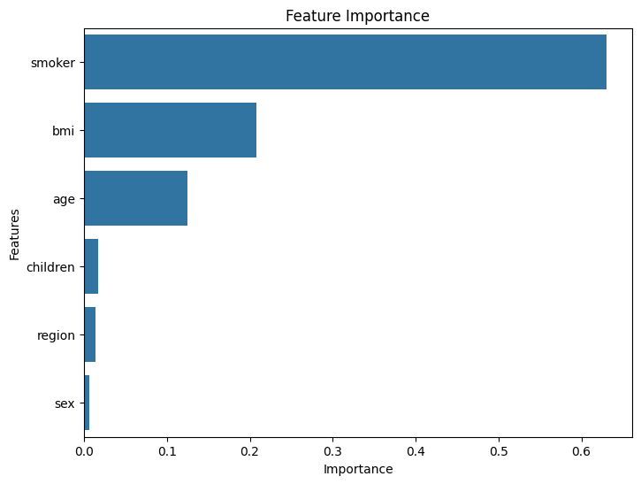

#  Medical Insurance Cost Prediction

A Machine Learning web application built using **Python**, **Scikit-learn**, and **Streamlit** that predicts medical insurance charges based on personal and health-related information.

## Live Demo

https://medical-insurance-cost-predictionn.streamlit.app/

---

##  Project Overview

This project uses a Random Forest Regression model to estimate medical insurance costs using the following features:

- Age
- Gender
- BMI
- Number of Children
- Smoking Status
- Region

The trained model is deployed using Streamlit, allowing users to interactively enter details and receive instant insurance cost predictions.

---

##  Dataset

- Medical Insurance Dataset
- Records: 2,772
- Features: 6
- Target: Insurance Charges

---

##  Machine Learning Workflow

- Data Cleaning
- Exploratory Data Analysis (EDA)
- Feature Encoding
- Model Training
- Model Evaluation
- Hyperparameter Tuning
- Streamlit Deployment

---

##  Models Compared

- Linear Regression
- Decision Tree Regressor
- Random Forest Regressor 
- Gradient Boosting Regressor

Random Forest achieved the best performance and was selected as the final model.

---

##  Results

| Metric | Value |
|--------|-------|
| R² Score | 0.95 |
| RMSE | 2767.29 |
| MAE | 1317.32 |

---

##  Screenshots

### Home Page



### Prediction



### Feature Importance



---

##  Technologies Used

- Python
- Pandas
- NumPy
- Scikit-learn
- Streamlit
- Matplotlib
- Seaborn

---

##  Project Structure

```text
Medical_Insurance_Streamlit_App/
│
├── images/
├── report/
├── app.py
├── train_model.py
├── model.pkl
├── insurance.csv
├── requirements.txt
└── README.md
```

---

##  Run Locally

Install dependencies:

```bash
pip install -r requirements.txt
```

Run the Streamlit app:

```bash
python -m streamlit run app.py
```

---

##  Author

**Zaara Khan**

B.Tech CSE Student
